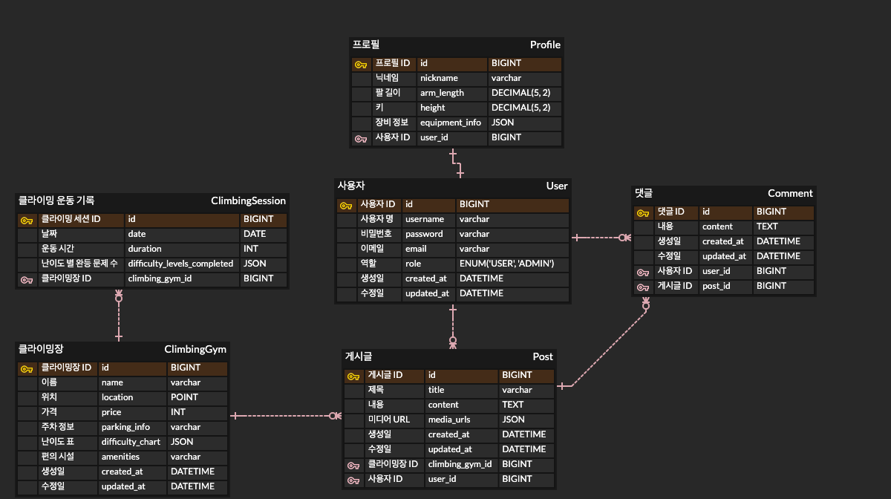

# 🗒 Climbing Record App
간단히 클라이밍 애호가들이 자신의 운동 기록을 관리하고, 다양한 문제 풀이 방식을 공유하며, 커뮤니티 내에서 소통할 수 있는 플랫폼입니다.

## 프로젝트 기능 및 설계
- 사용자 관리 기능
  - 회원가입 기능
    - 사용자는 회원가입을 할 수 있다.
    - 회원가입 시 아이디와 비밀번호를 입력받으며, 아이디는 고유해야 한다.
    - 기본적으로 모든 사용자는 USER 권한을 가진다.
  - 로그인 기능
    - 사용자는 로그인할 수 있다.
    - 로그인 시 회원가입 시 사용한 아이디와 비밀번호가 일치해야 한다.
  - 프로필 관리 기능
    - 사용자는 자신의 프로필을 조회하고 수정할 수 있다.
    - 프로필에는 닉네임, 신체 정보 (팔 길이, 키), 사용하는 장비 정보 등이 포함된다.
    
- 운동 기록 관리 기능
  - 클라이밍 세션 기록 추가 기능
    - 사용자는 자신의 클라이밍 세션을 기록할 수 있다.
    - 기록 항목에는 날짜, 운동 시간, 난이도 별 완등한 문제 수 등이 포함된다.
  - 클라이밍 세션 목록 조회 기능
    - 사용자는 자신의 클라이밍 세션 기록을 목록으로 조회할 수 있다.
  - 월간 운동 정보 통계 및 그래프 제공 기능
    - 월별 운동 빈도 통계 및 그래프를 제공한다.
    
- 커뮤니티 기능
  - 게시글 작성 기능
    - 로그인한 사용자는 클라이밍 장 별로 게시글을 작성할 수 있다.
    - 게시글에는 텍스트와 사진 및 동영상을 업로드 할 수 있다.
  - 댓글 작성 및 관리 기능
    - 모든 사용자는 게시글에 댓글을 작성하고 관리할 수 있다.
  - 일일 소모임 기능
    - 사용자는 일일 모임을 주최하거나 참여할 수 있다.
    - 소모임에는 제목, 설명, 날짜, 시간, 정원 수 등이 포함된다.
    - 소모임 참여 상태 (PENDING, JOINED, CANCELLED) 를 관리한다.
## ERD 

## Trouble Shooting
[go to the trouble shooting section](doc/TROUBLE_SHOOTING.md)

### Tech Stack

 
   
   
   
  

